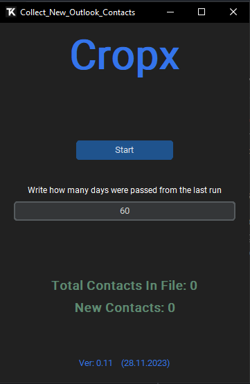

# Collect_new_outlook_contacts

#### The script collects new contacts from a shared calendar.
***

***
1. Write how many days were passed from the last report.
2. Click on start button and select the last updated file.
3. The script will collect all the meetings from the shared calendar.
4. Then it will filter the meetings that occurred in the given days.
5. After that, it will create a copy of the selected file.
6. The script will append new contacts to the new file.

***

**Compile process.**
1. Run "auto_py_to_exe".
2. Go to settings and import the file "Compile.json".
3. At the end you will get a executable file "export_data_from_outlook.exe".

